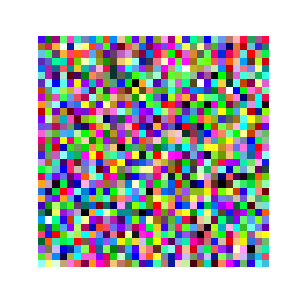
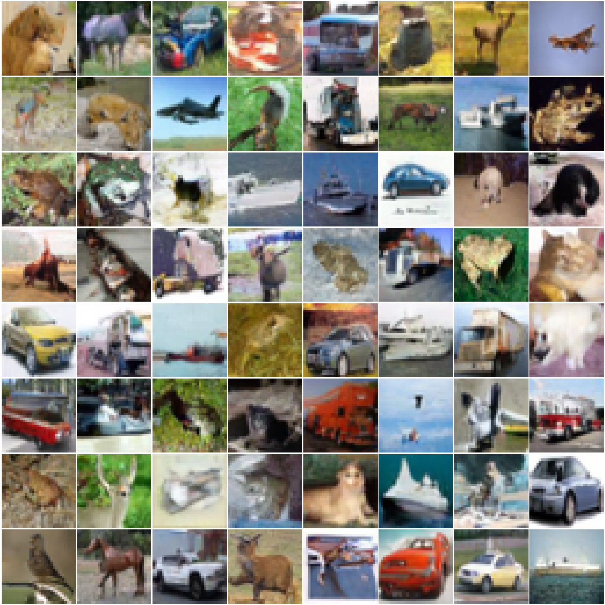
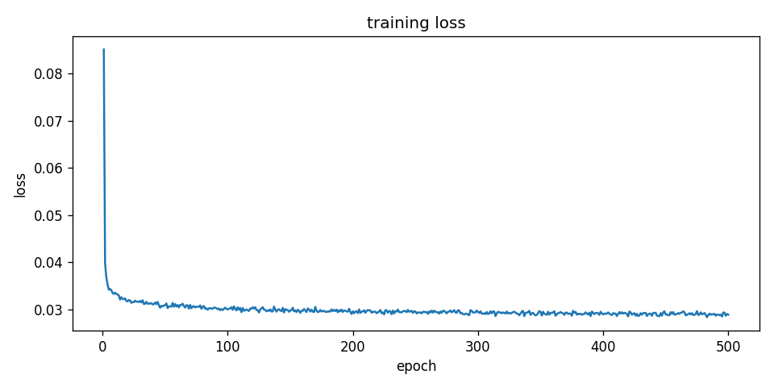

# DDPM on CIFAR-10

A from-scratch implementation of Denoising Diffusion Probabilistic Models trained on CIFAR-10.



---

## How it works

Score matching asks a simple question: given a corrupted sample, what direction points toward higher data density? Training a neural network to answer that question at every noise level is enough to build a generative model. You corrupt real images with Gaussian noise, teach the network to predict the noise that was added, and repeat for thousands of noise magnitudes indexed by a timestep t.

The DDPM training objective follows directly from denoising score matching. Both minimize the same expected squared error, just written with a different parameterization. Instead of predicting the score directly, the network predicts the noise epsilon that was added in the forward process. The two are related by a constant factor that depends on the noise schedule, so the model is learning the same thing either way.

Sampling runs the process in reverse. Starting from pure Gaussian noise, the model iteratively removes a small amount of noise at each step, guided by its prediction of what noise is present. After 1000 steps the result is a new image that was never in the training set.

## Setup

```bash
conda env create -f environment.yml
conda activate ddpm-cifar10
```

## Training

```bash
python train.py
```

To resume after interruption:

```bash
python train.py --resume checkpoints/ckpt_epoch0050.pt
```

Checkpoints are saved to `checkpoints/` every 5 epochs. Training for 500 epochs on a single GPU takes roughly 6 hours. The script uses exponential moving average (EMA) of the model weights, which consistently produces sharper samples than the raw weights.

## Sampling

```bash
python sample.py --checkpoint checkpoints/ckpt_epoch0500.pt
```

This writes `samples.png` (a grid of 64 generated images), `comparison.png` (real CIFAR-10 vs generated side by side), and `denoising.gif` (the reverse process for a single sample). Pass `--gif_seed N` to get a different sample in the GIF.

## Results

After 500 epochs:



Training loss over 500 epochs:



## Files

| File | What it does |
|---|---|
| `diffusion.py` | Noise schedule, forward process q(x_t \| x_0), DDPM loss, reverse step |
| `model.py` | Time-conditioned UNet with ResBlocks and self-attention |
| `train.py` | Training loop with EMA and checkpointing |
| `sample.py` | Generates image grid and denoising GIF from a checkpoint |

## References

Ho et al., [Denoising Diffusion Probabilistic Models](https://arxiv.org/abs/2006.11239), NeurIPS 2020.

Song and Ermon, [Generative Modeling by Estimating Gradients of the Data Distribution](https://arxiv.org/abs/1907.05600), NeurIPS 2019.
