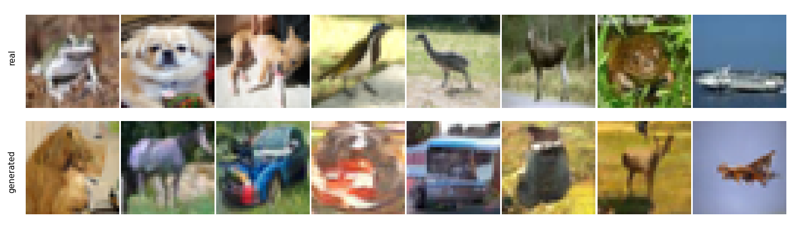

# DDPM on CIFAR-10


A from-scratch implementation of Denoising Diffusion Probabilistic Models trained on CIFAR-10.


---

## How it works

DDPM defines a fixed forward process that gradually destroys a clean image by adding a small amount of Gaussian noise at each of T=1000 timesteps. The closed-form for this process lets you jump directly from a clean image x_0 to any noisy version x_t in one shot: x_t = sqrt(alpha_bar_t) * x_0 + sqrt(1 - alpha_bar_t) * eps, where eps is standard Gaussian noise and alpha_bar_t is the cumulative product of the noise schedule.

Training asks the network to invert this: given a noisy image x_t and the timestep t, predict the noise eps that was added. The loss is a plain MSE between the true noise and the prediction. At inference time the same prediction is used to compute the reverse step mean, and a small amount of fresh noise is added, recovering x_{t-1} from x_t. Repeating this 1000 times starting from pure Gaussian noise produces a new image.

The connection to score matching: predicting eps is equivalent to estimating the score (gradient of log p) of the noisy distribution, related by a constant 1/sqrt(1 - alpha_bar_t). DDPM's gains over earlier score-based methods come from the continuous 1000-step schedule and the principled reverse-step variance derived from the forward process.

## Setup

```bash
conda env create -f environment.yml
conda activate ddpm-cifar10
```

## Training

```bash
python train.py
```

To resume after interruption:

```bash
python train.py --resume checkpoints/ckpt_epoch0050.pt
```

Checkpoints are saved to `checkpoints/` every 5 epochs. Training for 500 epochs on an Nvidia RTX A5000 takes roughly 10 hours. The script uses exponential moving average (EMA) of the model weights, which consistently produces sharper samples than the raw weights.

Hyperparameters used:

| Parameter | Value |
|---|---|
| Diffusion timesteps T | 1000 |
| Noise schedule | Linear, beta from 1e-4 to 0.02 |
| Epochs | 500 |
| Batch size | 128 |
| Learning rate | 2e-4 (Adam) |
| EMA decay | 0.9999 |
| UNet base channels | 64, multipliers [1, 2, 4, 4] |
| Model parameters | ~14M |

## Sampling

```bash
python sample.py --checkpoint checkpoints/ckpt_epoch0500.pt
```

This writes three files to `samples_output/`: `epoch{N}_samples.png` (a grid of 64 generated images), `epoch{N}_comparison.png` (real CIFAR-10 vs generated side by side), and `epoch{N}_denoising.gif` (the reverse process for a single sample). Pass `--gif_seed N` to get a different sample in the GIF.

## Results

After 500 epochs:


Real CIFAR-10 vs generated:



Training loss over 500 epochs:


## Files

| File | What it does |
|---|---|
| `diffusion.py` | Noise schedule, forward process q(x_t \| x_0), DDPM loss, reverse step |
| `model.py` | Time-conditioned UNet with ResBlocks and self-attention |
| `train.py` | Training loop with EMA and checkpointing |
| `sample.py` | Generates image grid and denoising GIF from a checkpoint |

## References

Ho et al., [Denoising Diffusion Probabilistic Models](https://arxiv.org/abs/2006.11239), NeurIPS 2020.

Song and Ermon, [Generative Modeling by Estimating Gradients of the Data Distribution](https://arxiv.org/abs/1907.05600), NeurIPS 2019.
